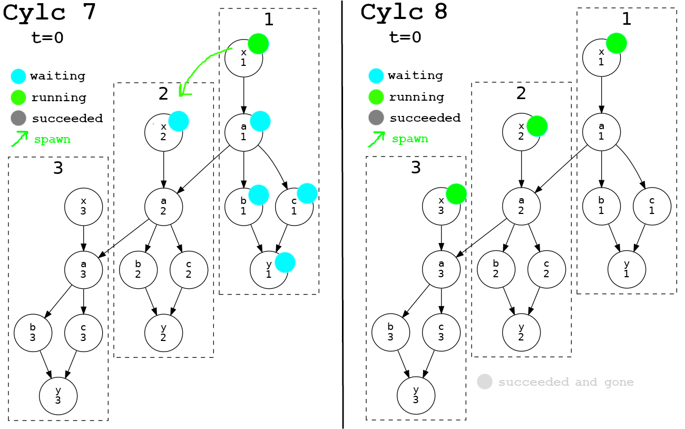
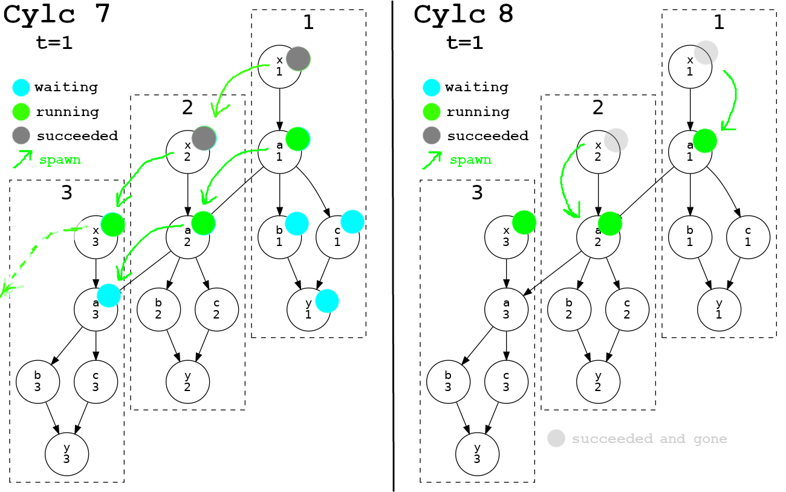
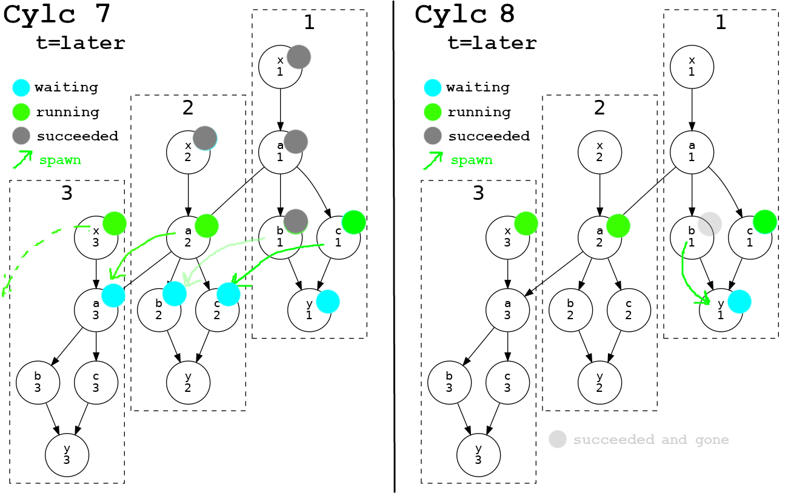

# Cylc 7 vs 8 Scheduling Comparison

This page gives an overview of the Cylc 7 and 8 scheduling algorithms,
how they affect manual interventions, and what you see in the GUIs.

(Many details and edge cases are omitted for clarity).

Terminology:
- **task pool:** the subset of all the tasks in the potentially infinite graph
that the scheduler currently retains in memory to support its scheduling algorithm

## Cylc 7 Scheduling Algorithm (simplified)

Cylc 7 initializes its *task pool* with a *waiting* instance of every task
at the first cycle point. Those with no prerequisites can submit immediately.

When a task (e.g. `a.1`) submits, the scheduler spawns its next-cycle
instance (`a.2`) as *waiting*.

When a task completes an output, the scheduler matches completed outputs
with unsatisfied prerequisites across the task pool to see if other
tasks become ready.

*Succeeded* tasks can only be forgotten when there are no more *waiting*
tasks left that could potentially be satisfied by them (roughly, no waiting
tasks remaining in the same cycle point, modified by intercycle dependence).

*So Cylc 7 evolves the workflow forward by spawning the next-cycle instance
of each task at submit time, not by following the graph! The pre-spawned
tasks do then run according to the graph, however.*

Comments:
 - the historical justification for this algorithm is documented elsewhere
 - it works amazingly well, but has some notable problems resulting from:
   - spawning of tasks long before they are needed, and a large task pool
   - `O(n^2)` (in number of tasks) prerequisite-output matching
   - implicit dependence on previous-instance submit

### Cylc 7 Manual Interventions

In Cylc 7 you can only match and operate on tasks that remain in the task pool.

However, in clock-limited real-time workflows the bloated Cylc 7 pool makes it
likely that "all the tasks" remain in the pool for the current cycle, which makes
mass interventions easier than one might expect for this model.

Beyond the task pool you must *insert* tasks before running anything:
- to rerun a sub-graph, insert all sub-graph tasks before triggering the first
  (because Cylc 7 doesn't automatically spawn tasks according to the graph)
- and the inserted tasks will spawn their next-cycle instances on submit
  (as per Cylc 7 normal) which will likely result in "stuck" waiting tasks
  that need to be removed in the next cycle

### What You See in the Cylc 7 GUI

The Cylc 7 GUI shows (in all views) only the current task pool, end of story.

However, the task pool is bloated and it is likely that "all the tasks" remain
in the current cycle of real-time clock-triggered workflows.

--------------

## Cylc 8 Scheduling Algorithm (simplified)

The dependency graph is a network of `parent => child` relationships. Cylc 8
initializes its task pool with a waiting instance of every parentless task,
out to the runahead limit. These can all submit immediately (no prerequisites).

Whenever a task completes an output the scheduler spawns the associated
downstream child task "on demand".

Tasks can be forgotten immediately once they reach a final status (succeeded,
failed, expired) so long as their required outputs are complete. 

*Cylc 8 both evolves and runs the workflow according to the graph.*

Comments:
- this is conceptually much simpler than Cylc 7
- it solves all of the problems that the Cylc 7 algorithm suffers from

### Cylc 8 Manual Interventions

Unlike Cylc 7, in Cylc 8 you can operate on individual tasks anywhere in
the infinite graph.
Downstream activity will flow naturally with no setup (reset or insert)
required because the Cylc 8 algorithm automatically spawns future tasks
"on demand" exactly as the graph dictates.

Just like Cylc 7, matching tasks by glob or family name only works in the
task pool.

However, the leaner Cylc 8 task pool can make mass interventions more
difficult than Cylc 7 (assuming that all involved tasks remain in the
Cylc 7 task pool, that is) e.g. to target all members of a family by name.

*We will address out-of-pool task matching by family name and glob in
upcoming 8.x releases.*

### What You See in the Cylc 8 GUI

The Cylc 8 GUI shows (in all views) a configurable graph-based window around
the task pool. The default `n=1` window shows all tasks out to 1 graph edge
from the (`n=0`) task pool.

How much of the workflow you see in the Cylc 8 GUI is just a choice.

-----------

## Cylc 7 vs Cylc 8 Scheduling - Illustrated Example

The following images show, side-by-side, the Cylc 7 and 8 task pools
and indicates how they evolve by spawning future tasks into the pool.

### Time Zero (start up)

Cylc 7 starts with the first instance of every task.

Cylc 8 starts with just the parentless tasks at the top of each cycle.

If the graph had 1000 tasks downstream of `x` the Cylc 7 task pool would
initially number 1001, but Cylc 8 would still have just 3 tasks.

-------

### Time One (later)

The Cylc 7 task pool expands across active cycle points. It may contain up
to N times the number of tasks per cycle, where N is the number of cycles. 

The Cylc 8 task pool is typically far smaller and is not affected by spread
over active cycle points.

-------

### Time Two (later again)

The Cylc 7 task pool continues to grow as the active cycle points fill out.
The scheduler can't clear out cycle 1 until no waiting tasks remain there.

Note the content of the Cylc 7 task pool can't be explained without
understanding the scheduling algorithm.

The Cylc 8 pool is easily explained: there are 3 active tasks (obvious) and
one waiting (spawned by `1/b:succeeded`, still waiting on `1/c:succeeded`). 
